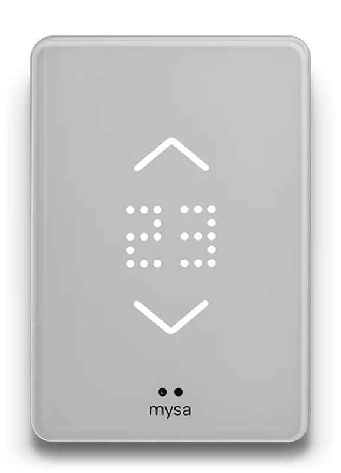
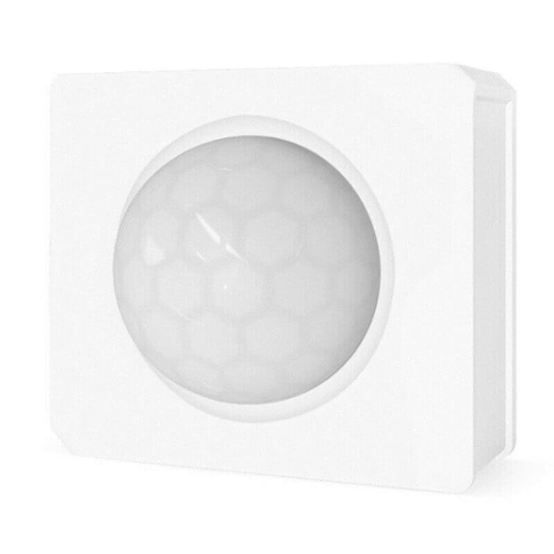

# Welcome to Ottawa

See the sidebar for links to useful things

## Overview

Welcome! Make yourself at home!

### Getting the A/C working

!!! info

    Because this A/C system uses chilled water from the building, it does not get much cooler than ~22°C, and may not even get that cool during extremely hot days. It also takes a while to cool down, though upping the fan speed can help increase air flow in the unit.

The A/C system here is a little complex, and requires two steps.

1.  Turn on the Honeywell thermostat in the living room to `cool`

2.  Go to the laundry closet in the hallway. On the left side beside the breaker, there is a dial. This controls the A/C fan. Switch it to a non-off position

    

    !!! tip

        This dial controls the A/C fan, but it can also be used to increase airflow when the A/C is off as well

### Heating

Heating works via baseboard heaters in the bedrooms, as well as in the living room. Heat can be controlled on a per-room basis using the thermostats in each of the above rooms.

!!! note

    When enabling the heat in the living room, make sure the couch is not touching the baseboard heater, and that there is a gap around the heater of around `2 inches` or so

In the living room, the Mysa thermostat is the one responsible for controlling the heating. 

This can be set by either

- Setting the temperature directly on the thermostat display

or

- Using the Google Nest hub in the kitchen (or the Google Home app on a phone) to set the temperature for any room with a Mysa thermostat. The guest bedroom uses an older analog thermostat, and must be manually set.

### Home automations

- The light against the back wall of the bedroom is motion activated between the hours of `12am` and `7am`, and will turn on for `4 minutes` when activated.

    If this is undesirable, you can either

    - turn off the light,

      or

    - turn the motion sensor so it faces the wall, then turn the light back on, and it should act normally.

      

- When using the TV after sunset, the light in the corner will fade on, and will automatically turn itself off a few minutes after the TV is turned off. You don't need to manually turn off the light unless you want it off :smile:

### Nighttime safety

The area is generally pretty safe, however some of the streets can be a bit unpleasant to walk down late at night. While there is a semi-permanent police presence on Cumberland right around the condo building, some of the other streets in the area can get a bit more rowdy.

Generally, avoiding the areas marked in red below after dark is recommended, as while they are safe, some more rowdy characters can hang out in these areas.

### Misc

If needed, there are:

#### Cleaning Supplies

- cleaning supplies in the laundry closet in the main hall
- a vacuum cleaner in the guest bedroom closet
- a mop and bucket in the entryway closet
- Lysol wipes under the sink in the kitchen

#### Food
- Additional coffee beans can be found in the second drawer under the coffee maker
- Teas can be found in the cupboard above the microwave
- Non-refrigerated sauces can be found in the corner cupboard above the counter

#### Electronics

- Chargers can be found in the master bedroom storage unit, in the top bucket
- Charging cables can be found scattered throughout the chargers in the rooms, additional cables can be found in the master bedroom storage unit in the top bucket